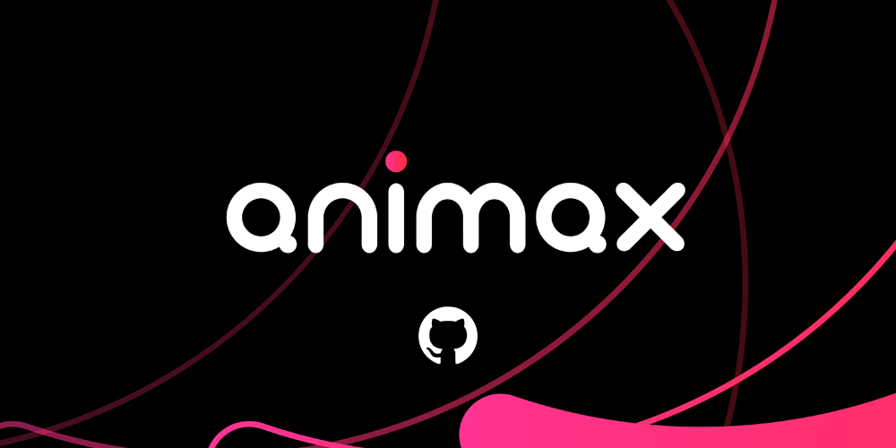

Animax is a vibrant, small town community-like platform where creatives and users come together to share, connect, and thrive. Users can discover fresh content and the talented creators behind it, while creatives receive real-time feedback, recognition, and meaningful support from their community.

With commitment to open source, Animax is aiming to constantly improve and evolve as the hub for creative ventures.

## Looking for an opportunity to work with us?
Check out [our blog](https://developer.animax.me) for more information.

👋 See you over @ [Animax](https://animax.me/)
